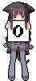

### 
 

 

  <a href="#"><a/>
  <a href="#"><a/>
  <a href="#"><a/>

## **ABOUT ME**

I'm er rickow and my hobbies are playing ur heart. So, don't too close on me and you will be find.

_also i'm noob on this coding_.
  

## **📊 Github Stats**

<h4 align="center"><i class="fas fa-align-center"></i>No One Can See Me In Here! :eyes:</h4>

    

